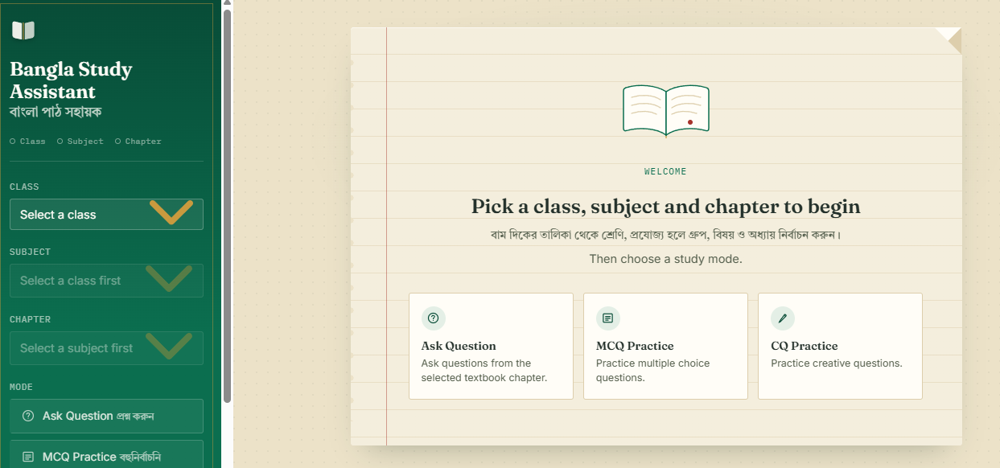
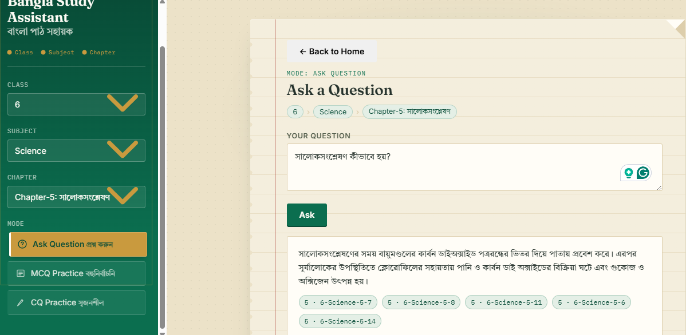
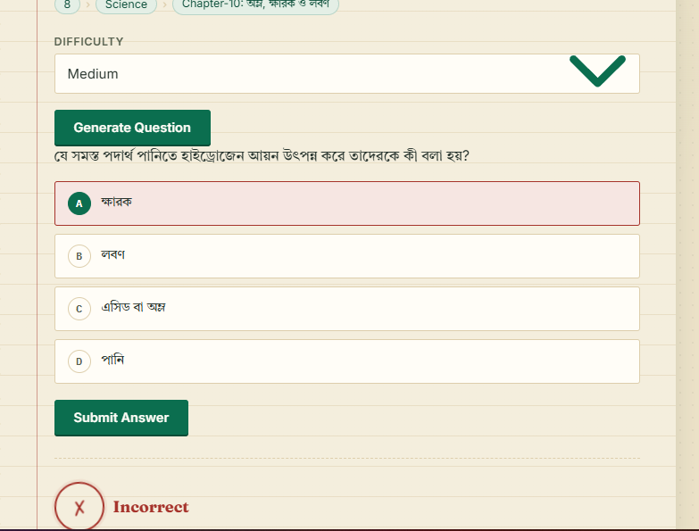
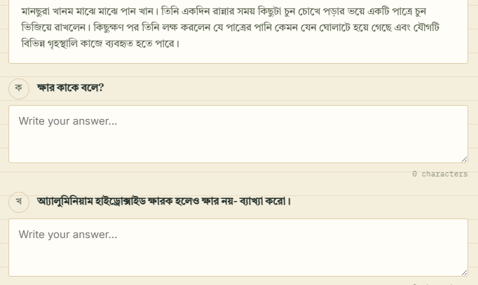
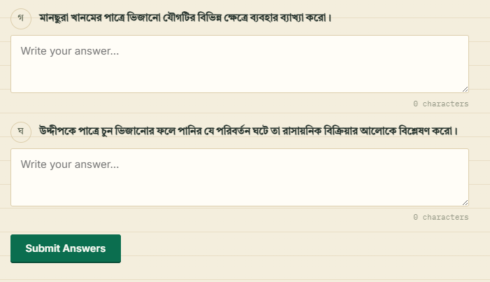
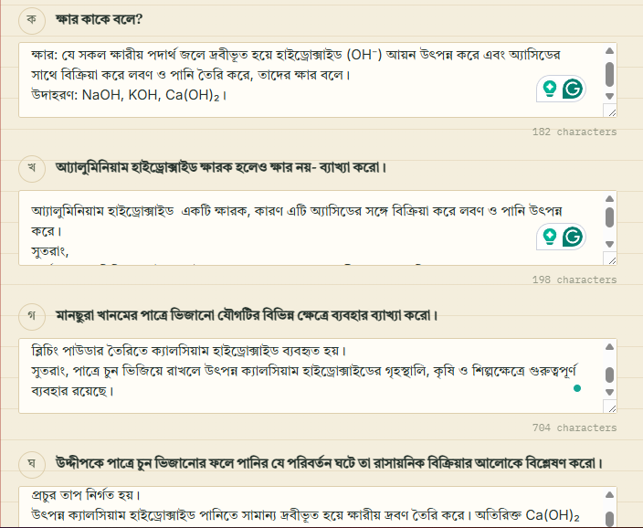
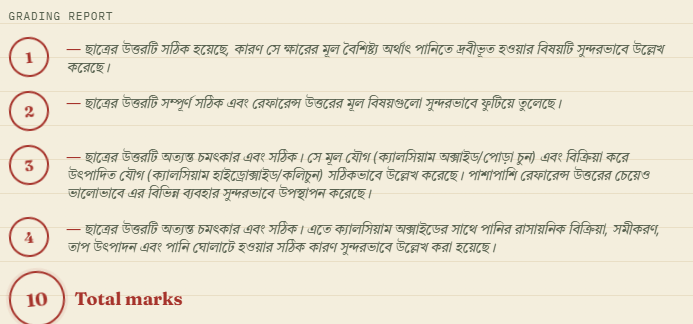

# 📚 Curriculum-Based Bangla QA System

**Curriculum-Based Bangla Study Assistant for NCTB School Students**

[](https://www.python.org/)
[](https://fastapi.tiangolo.com/)
[](https://ai.google.dev/)
[](https://www.trychroma.com/)
[](LICENSE)

A curriculum-aware **Bangla Question Answering and Learning Assistant** designed for students following the **Bangladesh National Curriculum and Textbook Board (NCTB)** curriculum.

The system allows students to select their **class, subject, and chapter** and then interact with curriculum-grounded educational content through:

- 💬 Question Answering
- 📝 Multiple Choice Question (MCQ) Practice
- ✍️ Creative Question (CQ) Practice
- 🎯 Difficulty-based question generation
- ✅ Automated answer grading
- 🔎 Curriculum-aware passage retrieval
- 🇧🇩 Bangla-language educational support

## 🌐 Live Demo

**Live Application:**  
https://curriculum-based-qa-system.onrender.com/

**Source Code:**  
https://github.com/Munfa/curriculum-based-qa-system

---

# 📸 Application Screenshots


## 1. Home / Curriculum Selection

The student begins by selecting the appropriate class, subject, chapter, and study mode.
### Home Page



---

## 2. Question Answering

Students can ask questions related to the selected curriculum content.

### Question Answering



### Example Input

```text
Class: Class 6
Subject: Science
Chapter: Chapter 5
Question: সালোকসংশ্লেষণ কীভাবে হয়??
```

### Example Output

```text
সালোকসংশ্লেষণের সময় বায়ুমণ্ডলের কার্বন ডাইঅক্সাইড পত্ররন্ধের ভিতর দিয়ে পাতায় প্রবেশ করে। এরপর সূর্যালোকের উপস্থিতিতে ক্লোরোফিলের সহায়তায় পানি ও কার্বন ডাই অক্সাইডের বিক্রিয়া ঘটে এবং গুকোজ ও অক্সিজেন উৎপন্ন হয়।
```


---

## 3. MCQ Practice

The system can generate curriculum-specific multiple-choice questions with different difficulty levels.


Supported difficulty levels:

- Easy
- Medium
- Hard

Example generated structure:

```text
Question:
....................................................?

A. Option A
B. Option B
C. Option C
D. Option D
```

Students can select an option and receive automated feedback.

### MCQ Practice



---

## 4. Creative Question (CQ) Practice

The system also supports Bangla Creative Questions (CQ).

### CQ Practice




A CQ contains four components:

```text
ক) Knowledge
খ) Understanding
গ) Application
ঘ) Higher-order / Analytical
```

Students submit answers for the individual components and receive scores and feedback.

### CQ Ourput





---

# 🎯 Project Overview

The goal of this project is to develop an AI-powered educational assistant that provides answers and practice questions based on the **Bangladesh NCTB curriculum** rather than relying solely on general-purpose knowledge.

The system follows a curriculum-aware retrieval and generation pipeline:

```text
Student
   │
   ▼
Web Interface
   │
   ▼
FastAPI Backend
   │
   ▼
Curriculum Selection
   │
   ▼
Semantic Retrieval
   │
   ▼
Relevant NCTB Textbook Passages
   │
   ▼
Google Gemini
   │
   ├───────────────┐
   ▼               ▼
Question Answer    Question Generation
                   │
                   ├── MCQ
                   └── CQ
   │
   ▼
Grading / Feedback
   │
   ▼
Student
```

---

# ✨ Key Features

## 1. Curriculum-Aware Question Answering

Students can ask questions within a specific:

- Class
- Subject
- Chapter

The system retrieves relevant textbook passages before generating the answer.

This helps keep responses aligned with the selected curriculum.

---

## 2. Semantic Passage Retrieval

The retrieval pipeline uses:

**Embedding Model:**

```text
intfloat/multilingual-e5-large
```

The query is converted into an embedding and compared against the indexed NCTB textbook passages.

The system uses **ChromaDB** as the persistent vector database.

The retrieval module supports filtering by:

```text
Class
Subject
Chapter
```

and returns the most relevant passage chunks.

---

## 3. AI-Powered Answer Generation

Retrieved passages are passed to the generation pipeline, which uses **Google Gemini** to generate structured educational responses.

The current LLM configuration uses:

```text
gemini-3.5-flash-lite
```

The model configuration is defined in:

```text
generation_grading/llm.py
```

---

## 4. MCQ Generation

The system generates multiple-choice questions based on the selected curriculum.

Supported difficulty levels:

```text
Easy
Medium
Hard
```

The generated MCQ contains:

- Question
- Four answer choices
- Question ID

Students can submit an answer and receive:

- Correct/incorrect status
- Correct answer
- Feedback

---

## 5. Creative Question Generation

The system supports Bangla Creative Questions with four sections:

```text
ক
খ
গ
ঘ
```

The generated CQ can be submitted for automated grading.

The grading system returns scores and feedback for each section.

---

## 6. Automated Grading

### MCQ Grading

The MCQ grading endpoint accepts:

```json
{
  "question_id": "mcq_1",
  "selected_option": "Option A"
}
```

and returns the grading result.

### CQ Grading

CQ grading accepts student responses for:

```text
ক
খ
গ
ঘ
```

and returns section-wise scores, feedback, and the total score.

---

# 🏗️ System Architecture

```text
                         ┌──────────────────────┐
                         │      Student         │
                         └──────────┬───────────┘
                                    │
                                    ▼
                         ┌──────────────────────┐
                         │   Frontend Web App   │
                         │     HTML / CSS / JS  │
                         └──────────┬───────────┘
                                    │
                                    ▼
                         ┌──────────────────────┐
                         │      FastAPI         │
                         │       Backend        │
                         └──────────┬───────────┘
                                    │
              ┌─────────────────────┼─────────────────────┐
              │                     │                     │
              ▼                     ▼                     ▼
      ┌───────────────┐     ┌───────────────┐     ┌───────────────┐
      │   Retrieval   │     │  QA / MCQ /   │     │   Grading     │
      │    System     │     │      CQ       │     │    System     │
      └───────┬───────┘     └───────┬───────┘     └───────────────┘
              │                     │
              ▼                     ▼
      ┌───────────────┐     ┌───────────────┐
      │   ChromaDB    │     │ Google Gemini │
      │ Vector Store  │     │      LLM      │
      └───────┬───────┘     └───────────────┘
              │
              ▼
      ┌───────────────────┐
      │ NCTB Textbook     │
      │ Passage Chunks    │
      └───────────────────┘
```

---

# 🧠 Retrieval-Augmented Generation Pipeline

The system follows a Retrieval-Augmented Generation (RAG)-style architecture.

## Step 1 — User Query

A student submits a question such as:

```text
সালোকসংশ্লেষণ কী?
```

along with the selected curriculum information.

---

## Step 2 — Query Embedding

The query is converted into a semantic embedding using:

```text
intfloat/multilingual-e5-large
```

The system uses the Hugging Face inference service for query embeddings.

---

## Step 3 — Vector Search

The embedding is searched against the ChromaDB collection:

```text
nctb_schooltext
```

The system retrieves the most relevant textbook chunks.

---

## Step 4 — Curriculum Filtering

Retrieval can be restricted using:

```text
Class
Subject
Chapter
```

For example:

```text
Class = 6
Subject = Science
Chapter = 5
```

This prevents unrelated curriculum content from being retrieved.

---

## Step 5 — Answer Generation

The retrieved passages are passed to the generation module.

Google Gemini generates the final educational response.

---

## Step 6 — Response

The answer is returned to the frontend and displayed to the student.

---

# 🛠️ Technology Stack

| Component | Technology |
|---|---|
| Programming Language | Python 3.11 |
| Backend Framework | FastAPI |
| API Server | Uvicorn |
| LLM | Google Gemini |
| Embedding Model | `intfloat/multilingual-e5-large` |
| Embedding Service | Hugging Face Inference API |
| Vector Database | ChromaDB |
| Data Processing | Python |
| Frontend | HTML, CSS, JavaScript |
| Data Format | JSON / JSONL |
| Deployment | Render |
| Version Control | Git / GitHub |

---

# 📁 Project Structure

```text
curriculum-based-qa-system/
│
├── api.py
├── main.py
├── requirements.txt
├── .python-version
├── .gitignore
├── LICENSE
│
├── frontend/
│   ├── index.html
│   ├── css/
│   ├── js/
│   │   ├── app.js
│   │   ├── api.js
│   │   ├── config.js
│   │   └── mockApi.js
│   └── data/
│
├── retrieval/
│   ├── retrieval.py
│   ├── build_index.py
│   ├── clean_corpus.py
│   ├── RETRIEVAL_CONTRACT.md
│   └── __init__.py
│
├── generation_grading/
│   ├── build_QA.py
│   ├── build_MCQ.py
│   ├── build_CQ.py
│   ├── grading.py
│   ├── get_patterns.py
│   ├── llm.py
│   └── __init__.py
│
├── question_pattern/
│
├── index_v1/
│   └── chroma_db/
│
├── cleaned/
│   └── chunks_v1.jsonl
│
└── docs/
    └── images/
        ├── home.png
        ├── qa-input.png
        ├── qa-output.png
        ├── mcq-input.png
        ├── mcq-output.png
        ├── cq-input.png
        └── cq-output.png
```

---

# 🐍 Python Version

The project specifies:

```text
Python 3.11
```

The repository contains a `.python-version` file specifying Python 3.11.

Check your Python version:

```bash
python --version
```

Expected:

```text
Python 3.11.x
```

Python 3.11 is recommended for the complete backend because the FastAPI code uses modern Python type-hint syntax such as:

```python
int | str
```

---

# ⚙️ Installation

## 1. Clone the Repository

```bash
git clone https://github.com/Munfa/curriculum-based-qa-system.git
```

Move into the project:

```bash
cd curriculum-based-qa-system
```

---

## 2. Create a Virtual Environment

### Windows

```bash
python -m venv venv
```

Activate:

```powershell
venv\Scripts\activate
```

### macOS / Linux

```bash
python3 -m venv venv
```

Activate:

```bash
source venv/bin/activate
```

---

## 3. Install Dependencies

```bash
pip install --upgrade pip
pip install -r requirements.txt
```

The repository currently specifies the following major dependencies:

```text
chromadb
google-genai
fastapi
uvicorn
pydantic
python-dotenv
requests
huggingface_hub
```

---

# 🔐 Environment Variables

The application requires API credentials for the external AI services.

Create a file named:

```text
.env
```

in the project root.

Add:

```env
GEMINI_API_KEY=your_gemini_api_key
HF_API_TOKEN=your_huggingface_token
```

### Google Gemini API

The generation pipeline reads:

```text
GEMINI_API_KEY
```

This key is used to communicate with Google Gemini.

### Hugging Face API

The retrieval pipeline reads:

```text
HF_API_TOKEN
```

This token is used to generate query embeddings through the Hugging Face inference service.

**Never commit `.env` or API keys to GitHub.**

The repository already ignores `.env` through `.gitignore`.

---

# 🗂️ Retrieval Data Requirements

The retrieval system expects two important artifacts:

```text
cleaned/chunks_v1.jsonl
```

and:

```text
index_v1/
└── chroma_db/
```

The retrieval module loads the Chroma collection:

```text
nctb_schooltext
```

and uses the cleaned passage file for curriculum metadata.

The repository's `.gitignore` is configured to keep the retrieval artifacts available while excluding the original NCTB ZIP dataset.

---

# 📚 Dataset

The system is designed around **NCTB SchoolText** curriculum data.

The raw dataset should not be committed to GitHub if redistribution is not permitted.

The preprocessing pipeline converts textbook material into cleaned passage chunks.

The general pipeline is:

```text
NCTB SchoolText
       │
       ▼
Corpus Cleaning
       │
       ▼
Quality Filtering
       │
       ▼
Cleaned JSONL
       │
       ▼
Multilingual E5 Embeddings
       │
       ▼
ChromaDB
       │
       ▼
Semantic Retrieval
```

---

# 🧹 Corpus Cleaning

The project includes:

```text
retrieval/clean_corpus.py
```

The cleaning pipeline performs quality filtering on textbook passages.

It evaluates:

- Character quality
- Text length
- Fragmentation
- Potential OCR problems
- Formula/table corruption

The pipeline produces:

```text
chunks_clean.jsonl
chunks_quarantined.jsonl
chapters_clean.jsonl
quality_report.json
```

---

# 🔎 Building the Vector Index

The vector index is generated using:

```text
retrieval/build_index.py
```

The default embedding model is:

```text
intfloat/multilingual-e5-large
```

Example:

```bash
python retrieval/build_index.py \
    --input cleaned/chunks_clean.jsonl \
    --out_dir index_v1 \
    --model intfloat/multilingual-e5-large
```

The resulting index contains a persistent ChromaDB database.

---

# 🚀 Running the Backend Locally

After installing the dependencies and configuring the environment variables, start the FastAPI server:

```bash
uvicorn api:app --reload
```

The API will normally be available at:

```text
http://127.0.0.1:8000
```

For network-accessible development:

```bash
uvicorn api:app --host 0.0.0.0 --port 8000
```

---

# 📖 API Documentation

FastAPI automatically provides interactive API documentation.

After starting the server, visit:

```text
http://127.0.0.1:8000/docs
```

You can also access the OpenAPI schema at:

```text
http://127.0.0.1:8000/openapi.json
```

---

# 🔌 API Endpoints

## Metadata

### Get Classes

```http
GET /metadata/classes
```

### Get Subjects

```http
GET /metadata/subjects?class=6
```

### Get Chapters

```http
GET /metadata/chapters?class=6&subject=Science
```

---

# 💬 Question Answering API

### Endpoint

```http
POST /qa
```

Example request:

```json
{
  "class": 6,
  "subject": "Science",
  "chapter": 5,
  "question": "সালোকসংশ্লেষণ কী?"
}
```

The backend retrieves relevant passages and generates an answer.

---

# 📝 MCQ API

## Generate MCQ

```http
POST /mcq/generate
```

Example:

```json
{
  "class": 6,
  "subject": "Science",
  "chapter": 5,
  "difficulty": "medium"
}
```

---

## Grade MCQ

```http
POST /mcq/grade
```

Example:

```json
{
  "question_id": "mcq_1",
  "selected_option": "Option A"
}
```

---

# ✍️ CQ API

## Generate CQ

```http
POST /cq/generate
```

Example:

```json
{
  "class": 6,
  "subject": "Science",
  "chapter": 5,
  "difficulty": "medium"
}
```

---

## Grade CQ

```http
POST /cq/grade
```

Example:

```json
{
  "question_id": "cq_1",
  "student_answers": {
    "ka": "Student answer",
    "kha": "Student answer",
    "ga": "Student answer",
    "gha": "Student answer"
  }
}
```

---

# 🖥️ Running the Frontend

The frontend is located in:

```text
frontend/
```

Because the application loads local JSON resources using JavaScript `fetch()`, it is recommended to run it through an HTTP server rather than opening `index.html` directly.

From the frontend directory:

```bash
cd frontend
python -m http.server 8000
```

Then open:

```text
http://localhost:8000
```

---

# 🔗 Connecting Frontend and Backend

The frontend API configuration is located at:

```text
frontend/js/config.js
```

The current configuration points to:

```text
https://curriculum-nlp-api.onrender.com
```

The important configuration is:

```javascript
const CONFIG = {
    USE_MOCK: false,
    BASE_URL: "https://curriculum-nlp-api.onrender.com",
    MOCK_LATENCY_MS: 250
};
```

To connect to a local backend, use:

```javascript
const CONFIG = {
    USE_MOCK: false,
    BASE_URL: "http://127.0.0.1:8000",
    MOCK_LATENCY_MS: 250
};
```

---

# 🔄 Application Workflow

A typical student workflow is:

```text
1. Open application
        ↓
2. Select Class
        ↓
3. Select Subject
        ↓
4. Select Chapter
        ↓
5. Select Study Mode
        ↓
6. Ask Question / Generate MCQ / Generate CQ
        ↓
7. Backend retrieves relevant curriculum content
        ↓
8. Gemini generates educational content
        ↓
9. Student receives answer/question
        ↓
10. Student submits response
        ↓
11. System grades response
        ↓
12. Feedback is displayed
```

---

# 🧩 Main Modules

## `api.py`

Provides the FastAPI backend and exposes the application's REST API.

Main responsibilities:

- Curriculum metadata
- Question answering
- MCQ generation
- MCQ grading
- CQ generation
- CQ grading

---

## `retrieval/`

Responsible for curriculum passage retrieval.

Important files:

```text
retrieval.py
build_index.py
clean_corpus.py
```

The retrieval module uses ChromaDB and multilingual E5 embeddings.

---

## `generation_grading/`

Contains the question-generation and grading pipeline.

Main components:

```text
build_QA.py
build_MCQ.py
build_CQ.py
grading.py
llm.py
get_patterns.py
```

---

## `frontend/`

Contains the browser-based user interface.

The frontend handles:

- Class selection
- Subject selection
- Chapter selection
- Study mode selection
- Question input
- MCQ interaction
- CQ interaction
- API communication
- Loading states
- Error messages
- Response rendering

---

# 🌍 Deployment

The application is deployed using **Render**.

The production application is available at:

```text
https://curriculum-based-qa-system.onrender.com/
```

For a Render deployment, the backend can be started with:

```bash
uvicorn api:app --host 0.0.0.0 --port $PORT
```

Required environment variables should be configured in the Render dashboard:

```text
GEMINI_API_KEY
HF_API_TOKEN
```

---

# ⚠️ Important Deployment Notes

The application depends on external services:

### Google Gemini

Used for:

```text
Answer generation
MCQ generation
CQ generation
Grading
```

### Hugging Face

Used for:

```text
Query embedding
```

### ChromaDB

Used for:

```text
Curriculum passage retrieval
```

Therefore, a working deployment requires:

1. Valid Gemini API credentials
2. Valid Hugging Face API credentials
3. Correct retrieval artifacts
4. Correct environment variables
5. A working ChromaDB index

---

# 🧪 Testing the System

## Test Backend

Start:

```bash
uvicorn api:app --reload
```

Then open:

```text
http://127.0.0.1:8000/docs
```

Use the interactive Swagger interface to test each endpoint.

---

## Test Retrieval

You can test the retrieval module with:

```bash
python retrieval/retrieval.py "সালোকসংশ্লেষণ কী"
```

The retrieval system will return the top relevant passages together with their:

- Similarity score
- Class
- Subject
- Chapter
- Chapter title
- Chunk ID

---

# 📊 Example Retrieval Result

A retrieved passage has the following conceptual structure:

```json
{
  "text": "Relevant textbook passage...",
  "class": "6",
  "subject": "Science",
  "chapter_no": 5,
  "chapter_title": "Chapter Title",
  "chunk_id": "chunk-id",
  "score": 0.89
}
```

The similarity score is calculated from the ChromaDB distance.

---

# 🔐 Security

Do not commit API credentials.

Never add:

```text
.env
```

to GitHub.

Do not hard-code:

```text
GEMINI_API_KEY
HF_API_TOKEN
```

inside Python or JavaScript files.

Use environment variables instead.

---

# 📝 Known Limitations

The current system depends on external AI services for:

- Query embeddings
- LLM generation
- Automated grading

Therefore, API availability and rate limits can affect response generation.

The quality of generated answers and questions also depends on:

- Retrieved textbook passages
- Embedding quality
- LLM generation
- Curriculum data quality
- Prompt design

---

# 🚧 Future Improvements

Potential future improvements include:

- [ ] User authentication
- [ ] Student progress tracking
- [ ] Personalized learning recommendations
- [ ] Conversation history
- [ ] More comprehensive automated evaluation
- [ ] Human evaluation of generated questions
- [ ] Retrieval quality evaluation
- [ ] Answer faithfulness evaluation
- [ ] Improved CQ grading
- [ ] Multi-turn tutoring
- [ ] Voice-based question answering
- [ ] Image-based question answering
- [ ] Teacher dashboard
- [ ] Student performance analytics
- [ ] Adaptive difficulty
- [ ] More NCTB curriculum coverage

---

# 📌 Project Highlights

This project demonstrates the integration of:

**Natural Language Processing + Information Retrieval + Large Language Models + Educational Technology**

The key technical components are:

```text
NCTB Curriculum
      +
Text Preprocessing
      +
Multilingual Embeddings
      +
Vector Database
      +
Semantic Retrieval
      +
Large Language Model
      +
Automated Question Generation
      +
Automated Grading
```

---

# 👩‍💻 Authors / Contributors

Developed as a curriculum-based Bangla educational AI system.

**GitHub Repository:**  
https://github.com/Munfa/curriculum-based-qa-system

**Live Demo:**  
https://curriculum-based-qa-system.onrender.com/

---

# 📄 License

This project is licensed under the **MIT License**.

See [`LICENSE`](LICENSE) for details.

---

# ⭐ Acknowledgements

This project builds upon technologies and open-source tools including:

- NCTB educational curriculum resources
- Google Gemini
- Hugging Face
- ChromaDB
- FastAPI
- Uvicorn
- Python

---

## 📸 Recommended Screenshot Folder

For the cleanest GitHub presentation, create:

```text
docs/
└── images/
    ├── home.png
    ├── qa-input.png
    ├── qa-output.png
    ├── mcq-input.png
    ├── mcq-output.png
    ├── cq-input.png
    └── cq-output.png
```

Then take screenshots from the live application and save them with those exact names.

GitHub will automatically render the screenshots in the README.

---

## 📚 References to Source Code

The major implementation components can be found in:

- `api.py` — FastAPI application and API endpoints
- `retrieval/retrieval.py` — semantic retrieval
- `retrieval/build_index.py` — ChromaDB index construction
- `retrieval/clean_corpus.py` — corpus cleaning
- `generation_grading/build_QA.py` — QA generation
- `generation_grading/build_MCQ.py` — MCQ generation
- `generation_grading/build_CQ.py` — CQ generation
- `generation_grading/grading.py` — answer grading
- `generation_grading/llm.py` — Gemini integration
- `frontend/` — web interface

---

# 🚀 Quick Start

For experienced developers:

```bash
git clone https://github.com/Munfa/curriculum-based-qa-system.git
cd curriculum-based-qa-system

python -m venv venv
```

### Windows

```powershell
venv\Scripts\activate
```

### macOS/Linux

```bash
source venv/bin/activate
```

Install dependencies:

```bash
pip install -r requirements.txt
```

Configure:

```env
GEMINI_API_KEY=your_key
HF_API_TOKEN=your_token
```

Run:

```bash
uvicorn api:app --host 0.0.0.0 --port 8000
```

Open:

```text
http://127.0.0.1:8000/docs
```

For the web interface, configure:

```text
frontend/js/config.js
```

to point to the backend and serve the frontend using:

```bash
python -m http.server 8000
```
